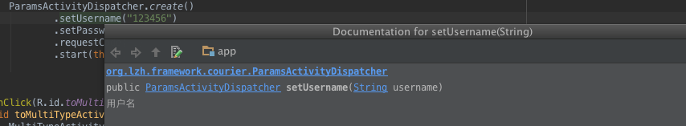
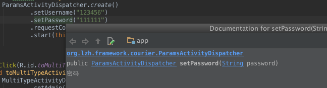

Courier框架用于使用编译时注解的方式.生成具体的java类做Activity与Fragment的传值跳转.

### Courier框架注解介绍

Courier框架包含两种可用的注解.@Params与@Field.

- @Params 可对Activity类或者Fragment类使用.如:

```
@Params
public class EmptyActivity extends Activity {
    ...
}
```

```
@Params
public class EmptyFragment extends Fragment {
    ...
}
```

- @Field 使用于@Params注解中.作为对可传参数的声明.如:

```
@Params(fields = {
        @Field(name = "username",type = String.class,doc = "用户名"),
        @Field(name = "password",type = String.class,doc = "密码"),
})
public class ParamsActivity extends Activity {
    ...
}
```

对Activity或者Fragment进行注解添加或修改后.需要点击Android Studio的build/make project 进行apt代码生成:


生成类规则:

- 若为对Activity类XXX使用,生成类名为XXXDispatcher,
- 若为对Fragment类XXX使用,生成类名为XXXBuilder.
- 获取传递到XXX类中的参数.均使用生成类XXXArgsData进行获取

#### @Params与@Field使用参数介绍:

```
public @interface Params {
    // 需要传递的所有参数的集合.
    Field[] fields() default {};

    // 指定是否让子类继承该注解中定义的fields参数集合
    boolean inherited() default true;
}
```

```
public @interface Field {
    // 必填项,需要生成的传递参数的名字
    String name();

    // 必填项,需要生成的传递参数的类型,可为基本数据类型或者实现了Serializable接口的可序死化对象.
    Class type();

    // 用于指定生成类中对于传递参数的doc注释.
    String doc() default "";

    // 用于指定此参数的默认值.
    String defValue() default "";

    // 与type结合使用,指定需要传递参数的真正类型,
    // eg.以type = String.class为例:
    // type      fieldtype               realtype
    // String + FieldType.Serializable = String
    // String + FieldType.list         = List<String>
    // String + FieldType.set          = Set<String>
    // String + FieldType.array        = String[]
    FieldType fieldType() default FieldType.Serializable;

}

```

以Activity为例,使用方式:

对Activity类使用@Params注解

```
@Params
public class EmptyActivity extends Activity {
    @Override
    protected void onCreate(Bundle savedInstanceState) {
        super.onCreate(savedInstanceState);
        setContentView(R.layout.activity_second);
    }
}
```

此处未含有需要传递的参数.故只使用了@Params注解.

make project生成完成后即可在任意界面进行如下链式调用进行页面跳转:

```
EmptyActivityDispatcher.create().start(MainActivity.this);
```

若为需要传递参数的界面.则对@Params注解中加入@Field注解:

```
@Params(fields = {
        @Field(name = "username",type = String.class,doc = "用户名",defValue = "admin"),
        @Field(name = "password",type = String.class,doc = "密码"),
})
public class ParamsActivity extends Activity {

    @Bind(R.id.username)
    TextView username;
    @Bind(R.id.password)
    TextView password;

    @Override
    protected void onCreate(Bundle savedInstanceState) {
        super.onCreate(savedInstanceState);
        setContentView(R.layout.activity_params);
        ButterKnife.bind(this);
        // 获取传参
        ParamsActivityArgsData data = ParamsActivityArgsData.getArguments(getIntent());
        // 获取传过来的username,password.
        username.setText(data.getUsername());
        password.setText(data.getPassword());

    }
}
```

可以看到.此处使用ParamsActivityArgsData类对传递过来的参数进行获取.

在需要传递跳转的页面进行如下调用进行快速跳转:

```
ParamsActivityDispatcher.create()
    .setUsername("123456")
    .setPassword("111111")
    .requestCode(-1)
    .start(this);
```

由于我们在定义时.对参数字段username,password添加了doc说明,在使用ParamsActivityDispatcher进行set操作时.可以看到此处设置的doc文档.





Courier可传值的参数类型.由Field注解中的type与fieldType共同指定,
type为实现了Serializable接口的类class,fieldType指定外层包裹.如:

```
@Params(fields = {
        // User为实现了Serializable接口的实体类
        @Field(name = "admin", type = User.class),// 此处未写fieldType.因为fieldType未写时默认使用FieldType.Serializable,此时实际传参类型为type本身的User类型,
        @Field(name = "listUser", type = User.class, fieldType = FieldType.list),// 此时传参类型为List<User>列表
        @Field(name = "arrayUser", type = User.class, fieldType = FieldType.array),// 此时实际传参数类型为User[]数组
        @Field(name = "setUser", type = User.class, fieldType = FieldType.set)// 此时实际传参类型为Set<User>集合
})
public class MultiTypeActivity extends Activity {

    @Bind(R.id.userInfos)
    TextView userInfos;

    @Override
    protected void onCreate(Bundle savedInstanceState) {
        super.onCreate(savedInstanceState);
        setContentView(R.layout.activity_multi_type);
        ButterKnife.bind(this);
        MultiTypeActivityArgsData arguments = MultiTypeActivityArgsData.getArguments(getIntent());
        StringBuffer buffer = new StringBuffer();
        buffer.append("admin:" + arguments.getAdmin())
                .append("\n")
                .append("listUser:" + arguments.getListUser())
                .append("\n")
                .append("arrsyUser:" + Arrays.toString(arguments.getArrayUser()));
        userInfos.setText(buffer.toString());
    }
}

// 要传递参数到MultiTypeActivity,如下调用:
MultiTypeActivityDispatcher.create()
    .setAdmin(new User("张三","密码0"))
    .setArrayUser(new User[]{new User("李四", "密码1")})
    .setListUser(Arrays.asList(new User[]{new User("王五","密码")}))
    .setSetUser(new HashSet<User>())
    .start(this);
```

对于使用于Fragment之上时.注解使用形式与Activity使用基本一致:

```
@Params(fields = {
        @Field(name = "password", type = String.class, doc = "用户密码")
})
public class SubFragment extends TestFragment {
    public static final String TAG = SubFragment.class.getCanonicalName();
    SubFragmentArgsData requestData;

    @Override
    public void onCreate(Bundle savedInstanceState) {
        super.onCreate(savedInstanceState);
        requestData = SubFragmentArgsData.getArguments(this);
    }

    @Override
    public void onViewCreated(View view, Bundle savedInstanceState) {
        super.onViewCreated(view, savedInstanceState);
        password.setText(requestData.getPassword());
    }
}
```

不同点在于传参时使用方式不同:

```
SubFragment build = SubFragmentBuilder.create()
        .setPassword("SubFragment pass : password")
        .build();
getFragmentManager().beginTransaction()
        .replace(R.id.frag_layout,build)
        .commit();
```

当然.在某些时候.我们并不需要直接一步直接生成Fragment实例或者直接跳转页面,我们只需要获取Activity需要传递的Intent或者Fragment的Bundle实例.

```
Bundle fragPass = SubFragmentBuilder.create().setPassword("password").createBundle();
Intent actPass = ParamsActivityDispatcher.create().setPassword("password").createIntent(this,true);
```